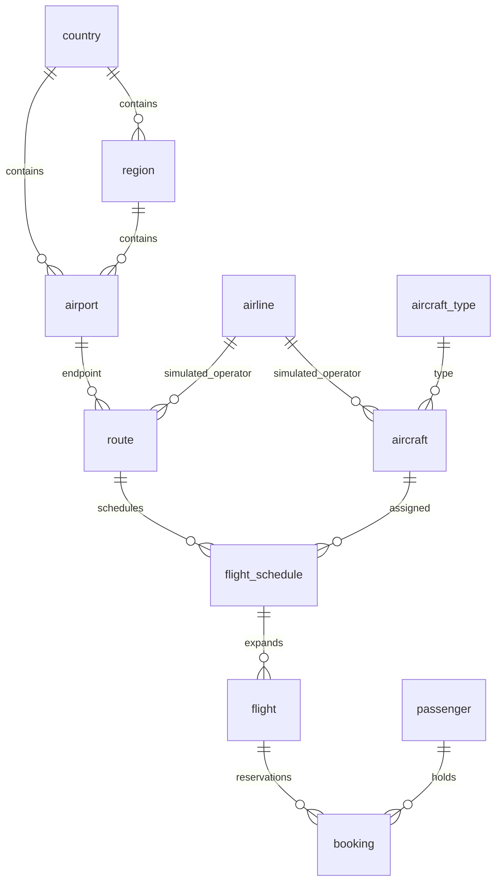

# Data dictionary

Documentation: MIT. Dataset compilation and synthetic records: CC BY 4.0.

## Masters

`country.country_code` and `region.region_code` use OurAirports identifiers.
`airport.airport_id` preserves the persistent OurAirports numeric ID; `ident`
preserves its interoperable identifier, which is not always an ICAO code.
`gps_code`, `icao_code`, `iata_code`, and `local_code` are nullable source fields.
Do not assume codes are globally unique. Source geography and links are retained.
Coordinates use decimal degrees; elevation uses feet.

`airport.timezone_name` is an IANA name only for the 30 simulation airports;
NULL elsewhere. All source airport rows remain included.

`airline.airline_id` is the numeric part of `wikidata_qid`, not an IATA code.
`name_en` falls back to QID; `name_ja` may be NULL. `iata_codes`, `icao_codes`,
`country_qids`, `inception_values`, `dissolved_values` are sorted JSON arrays.
Dates are stored as source strings in JSON because Wikidata values can have
different precision and years outside MySQL's DATE range. An empty dissolution
array does not establish that an airline is still operating.

All records from the configured query result are included; only selected
structured fields and best-rank values are exported. This is not the full
Wikidata entity/revision dump.

## Synthetic operations

- `aircraft_type`: synthetic 180-seat type; cruise speed 780 km/h; maximum block
  time 600 minutes. It does not represent a certified real aircraft model.
- `aircraft`: synthetic SYN identifier, airline and initial base airport.
- `route`: directional airline/origin/destination combination; great-circle
  distance in kilometers. Actual carrier routes and traffic rights are not modeled.
- `flight_schedule`: UTC date validity, UTC departure time, elapsed block minutes,
  weekdays 1=Monday through 7=Sunday (`1234567` in this profile).
- `flight`: schedule expanded by UTC service date; UTC planned and actual
  DATETIME values, local planned wall-clock values, completed/cancelled status.
  All are synthetic. Cancelled rotations have no actual timestamps.
- `passenger`: numbered synthetic name, reserved `.invalid` email address.
- `booking`: one passenger and seat per flight, synthetic price in USD, UTC
  booking datetime, confirmed/cancelled status. Currency conversion is not modeled.

Synthetic tables carry `is_synthetic=1` where applicable; aircraft identifiers
explicitly use SYN. A passenger may have unrelated bookings and is not guaranteed
to have a globally feasible itinerary. Reservation inventory is a learning
dataset, not a passenger travel simulator.

## CSV / SQL conventions

UTF-8, comma-delimited CSV with a header, RFC-style quote escaping, LF line endings.
Empty fields represent SQL NULL. JSON array columns always contain valid JSON,
including `[]` for no supplied values.

Generated SQL uses batches of 500 rows, utf8mb4 and NO_BACKSLASH_ESCAPES with
apostrophe doubling. Do not remove the SQL-mode setup. Import runs one transaction
per table and preserves foreign-key checking. A failed partial import should be
retried in a new empty schema, not with `--force`.

## Relationships

